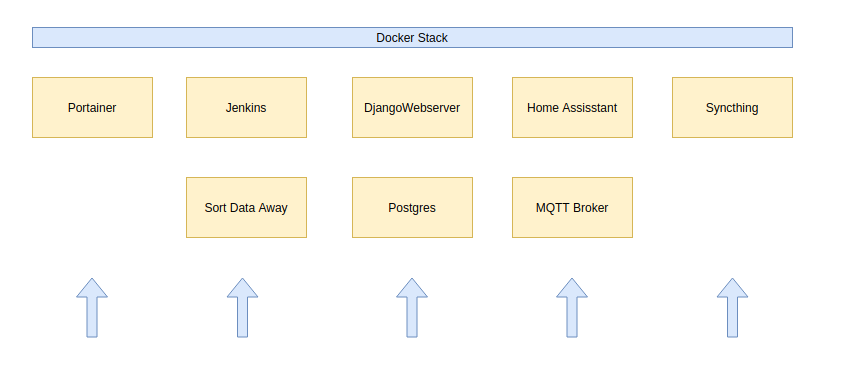

# Overview
This repo is a collection of IoT related stuff that is basically done entirely in my private time and just for fun.
I am using
- A raspberry pi 4 to deploy the Docker stuff and run the scripts,
- Use several [ESP8266](https://arduino-esp8266.readthedocs.io/en/latest/esp8266wifi/readme.html) to flash the software on

This [sketch](./DockerStack.drawio) is drawn with the help of [App.Diagrams](https://app.diagrams.net/) \

# Arduino Sketches
Wifi settings: energy safe mode off, reconnect to wifi after interupt, static ip

## Temperature and Humidity Sensors
code written in Arduino C

## Switch Relais
code written in micropython

preparations:
- getting the firmware (stable version for ESP8266, e.g. "esp8266-20200911-v1.13.bin")
- deploy firmware via esptool
    - pip install esptool
    - esptool.py --port /dev/ttyUSB0 erase_flash
    - esptool.py --port /dev/ttyUSB0 --baud 460800 write_flash --flash_size=detect 0 esp8266-20170108-v1.8.7.bin
- more info under: https://docs.micropython.org/en/latest/esp8266/tutorial/intro.html
- in pycharm install "micropython" plugin
- activate plugin in "framwork and languages"
- flash scripts in the right order:
    - umqttsimple.py
    - boot.py
    - main.py
- use REPL (nice!)

# Jenkins
- deploy via docker-compose
- deploy docker with datarchiver tool inside Jenkins docker

# Home Assisstant
Link to [Home Assisstant](https://www.home-assistant.io/) \
This runs in combination with the MQTT Broker [Eclipse Mosquitto](https://mosquitto.org/)

Just some hints:
- installtion on a raspi [link](https://www.home-assistant.io/docs/installation/raspberry-pi/)
- deploy via docker-compose
- start server under: http://ipaddress:8123
- copy configuration file (incl. sensor and alarm settings) to config folder
- copy lovelace gui raw code into home assistant gui

# Portainer
- docker volume create portainer_data
- docker run -d -p 9000:9000 -p 8000:8000 --name portainer --restart always -v /var/run/docker.sock:/var/run/docker.sock -v portainer_data:/data portainer/portainer
- [Useful Link to Deploy](https://portainer.readthedocs.io/en/latest/deployment.html)

## my_piprojects
- misc stuff like 
    - led blinking, when led connected to raspi 
    - tones, when loudespeaker connected to raspi

## Syncthing
This tool is used to sync the stuff on our mobile phones to the central server for backup reasons.
The (link)[https://syncthing.net/] to the project.
Note: there is also a syncthing app for Android which works quite well in combination with the syncthing 
on the server deployed via Docker.

## Nextcloud
hat nicht funktioniert. Warum auch immer kam immer die Meldung nach der Anmeldung (wenn mit postgres initialisiert):

"Interner Serverfehler" - Der Server konnte die Anfrage nicht fertig stellen ...

## License
[MIT](./LICENSE) 